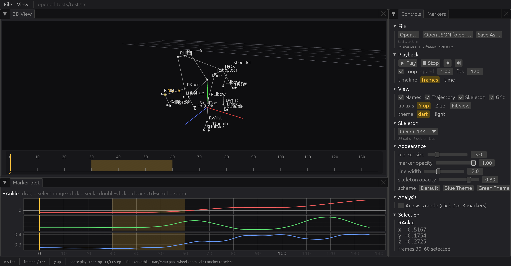

# Phase 4 results — application shell (`mstudio-app`)

Status: **done**. `cargo run --release -p mstudio-app -- tests/test.trc` opens the
native app on macOS (Metal); Windows/Linux builds are produced by CI and remain to
be exercised by hand.



## What exists

```
crates/mstudio-app/src
├── main.rs         eframe + wgpu (depth 24, MSAA 4, adapter limits for large takes), window icon from Content/icon.ico,
│                   CLI: [file | json folder] [--play] [--demo] [--screenshot out.png] [--exit-after s]
├── app.rs          Document {Take, StateManager, outliers}, Playback, egui_dock layout, Command queue,
│                   menus (File/View), shortcuts (Space/Enter/Esc/←/→/F/⌘O/⇧⌘S), drag & drop, error dialog,
│                   status bar with fps / frame / up-axis, auto skeleton detection on open
├── viewport.rs     egui paint callback around mstudio_render::Renderer (shared Arc<Mutex>), orbit/pan/zoom,
│                   CPU picking, reference-line click → axis cycle, marker-name labels, analysis readouts
├── timeline.rs     painted strip under the 3D view: frame/time ticks (nice steps), cursor, drag = scrub,
│                   shift/right-drag = range selection, double-click = clear
├── marker_plot.rs  egui_plot X/Y/Z of the selected marker, cached series keyed on (marker, data_version),
│                   current-frame line, selection band, click = seek, drag = select, ctrl-scroll = zoom
├── panels.rs       Controls tab (File · Playback · View · Skeleton · Appearance · Analysis · Selection) and Markers list
└── theme.rs        dark / light with the MStudio accent
```

Layout: 3D view + timeline (top-left), marker plot (bottom-left), Controls / Markers tabs (right); all dockable.

## Measured (Apple M5 Max, 120 Hz display, release build)

| | |
|---|---|
| Playback fps with names, trajectory, skeleton, grid and plots on | 109–119 (vsync-bound) |
| Release binary (`debug = 1` profile, unstripped) | 17.8 MB |
| Process lifetime with `--exit-after 0.3` (window + wgpu device + load + frames) | 0.46 s ⇒ **≈ 0.16 s to the first frame** (plan target < 0.5 s) |

Playback is driven by `mstudio_core::Playback::tick(now)` each frame with
`request_repaint()` only while playing (rule R3); idle the app repaints on input.

## Verified with screenshots (`--demo --screenshot`)

Docked layout · 29-marker take with COCO_133 auto-selected (26 pairs, 2 outlier
flags) · marker labels · selected marker (RAnkle) in accent colour with trajectory ·
timeline ticks, cursor and a 30–60 selection band · three coordinate plots with
correct data ranges and the same selection band · coordinates panel.

## Deviations / notes

| Plan item | Built | Note |
|---|---|---|
| `egui_dock` with all five areas as tabs | timeline is fixed under the 3D view instead of a dock tab | scrubbing belongs next to the view; also sidesteps egui_dock's minimum-size behaviour for thin leaves |
| Fit view | fits the **current frame**, not the whole take | the whole-take box of a walking trial framed the subject far too small (Phase 0 finding) |
| Skeleton default "No skeleton" | model with the most resolved pairs is chosen on open (≥ 3 pairs) | the Python app made the user pick every time |
| Marker size | uniform value ×2 pixels | Python's GL point size; ported as diameter |

Not yet in the app (Phase 5): edit mode, filters, interpolation, pattern selection, visual colour pickers, report.

## Next: Phase 5 — editing, processing panels, report
