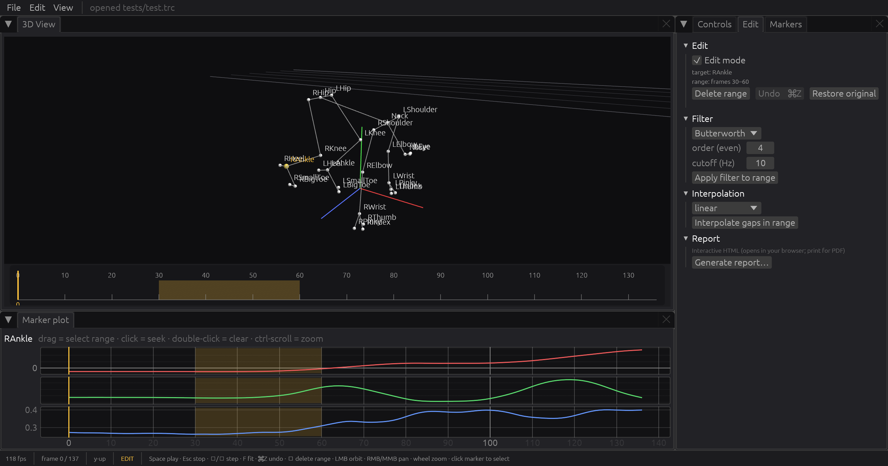

# Phase 5 results — editing, processing panels, report

Status: **done**. Every editing feature of MStudio v0.1.5 is in the Rust app, plus
undo, and the PDF report is replaced by an interactive HTML report.

## What exists

| Where | Feature |
|---|---|
| `mstudio-app/src/jobs.rs` | `Worker::spawn(Job)`: filter / interpolation / pattern-based / report run on a thread; the UI polls a channel (rule R4). Jobs carry only the columns they need (`[n, 1, 3]`, or `[n, 1 + refs, 3]` for pattern) — no full-take copies for edits |
| `app.rs` edits | delete range (⌫), restore original, **undo stack** (⌘Z, 50 entries, per-marker or whole-take snapshots), `after_edit`: `Renderer::update_frames(DirtyRange)` (rule R2) + `data_version` bump (plot cache) + outlier re-detection |
| Edit tab | Edit mode toggle, target / range readout, Delete / Undo / Restore; Filter (6 filters with the app's default parameters); Interpolation (9 methods, order for polynomial/spline, pattern-based with reference-marker selection by clicking in the 3D view); Report |
| Controls › Appearance | colour pickers for marker normal / selected / pattern and skeleton normal / outlier, schemes, reset |
| Edit menu, shortcuts | Undo ⌘Z, Delete ⌫, Restore original; status bar shows EDIT and "click reference markers" |
| `mstudio-processing/src/segments.rs` | `auto_segments` / `auto_joints`: the `skeleton_config.py` name patterns (CamelCase and snake_case) |
| `mstudio-report` | `build_model` → `ReportModel` (dataset overview, per-marker quality + coordinate stats, speed/acceleration stats, segment length + angle vs X/Y/Z, joint angles + ROM) → minijinja template → **one HTML file** with Plotly (MIT, 1.07 MB) inlined, marker selector, time range, segment-axis selector, `@media print` for PDF, chart data strided to ≤ 3 M numbers |
| CLI | `--selftest`: filter job → delete + undo (bit-exact round trip asserted) → report to `target/selftest_report.html`, no dialogs |

## Verified

- `--selftest` on `tests/test.trc`: Butterworth applied through the worker, delete + undo restores the take bit-for-bit, report written (1.66 MB) — all in one run, exit 0.
- Report opened in a browser: header, overview cards, per-marker table, Plotly charts with the marker selector and range inputs.
- 90 tests green (`cargo test --workspace`), clippy `-D warnings` clean.

## Deviations / notes

| | |
|---|---|
| Segment list in the report | skeleton pairs that duplicate a standard segment (same two markers) are not listed twice; the Python report compared names only, so `Thigh_R` and `RHip-RKnee` both appeared |
| Report format | HTML instead of PDF (decided in the plan); print from the browser for PDF |
| Outlier re-detection after an edit | runs inline on the UI thread (rayon, tens of ms at 300 × 50 000); move to the worker if it ever shows up in the frame time |
| Pattern references | the current marker cannot be its own reference; selection order is kept (the Python `set` had no order) |

## Parity checklist status (plan §8)

All rows are now implemented in the Rust app except the report → HTML swap and
"Python API" (Phase 6).
